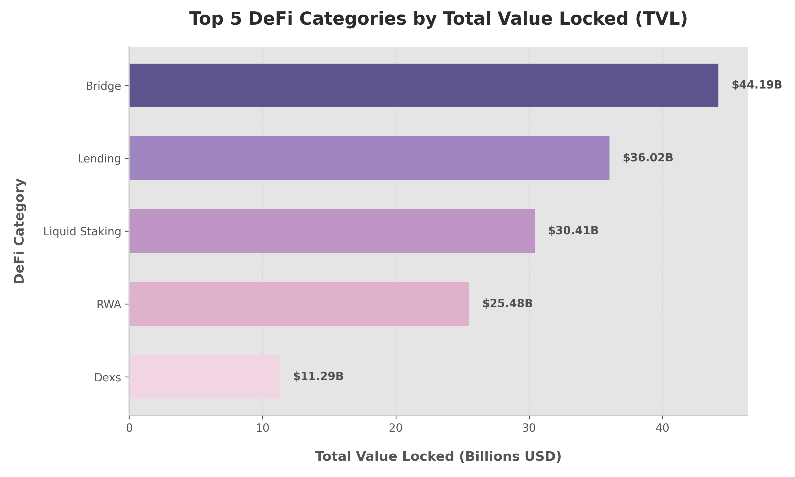

# DeFi Protocol TVL Comparison
 
A pipeline that pulls live protocol data from [DefiLlama](https://defillama.com/), cleans it with SQL via DuckDB, and surfaces key metrics around DeFi market share, protocol dominance, and growth momentum.
 
---
 
## Data Source
 
**DefiLlama API** — `https://api.llama.fi/protocols`
 
Free, no auth required. DefiLlama is the de facto standard for on-chain TVL tracking; its adapters are open-source and auditable on GitHub, which makes it a reliable foundation for any DeFi analytics work.
 
---
 
## Project Layout
 
```
.
├── fetch_defillama.py        # Hits the API and writes raw output to CSV
├── run_analysis.py           # Loads query.sql and runs it against the CSV via DuckDB
├── visualize.py              # Queries DuckDB and generates visual charts
├── query.sql                 # Core data cleaning + analytics query
├── category_tvl.png          # Generated data visualization chart
├── queries/                  # Subfolder containing specialized SQL queries
│   ├── 01_clean_top_protocols.sql
│   ├── 02_chain_dominance.sql
│   └── 03_market_concentration_hhi.sql
└── defillama_protocols.csv   # Raw dataset (auto-generated)
```
 
---
 
## Data Cleaning
 
Raw API responses need work before they're usable. `query.sql` handles this inside a CTE before any analysis runs:
 
*   **String Normalization**: Trims whitespace from `name`, `symbol`, and `category`.
*   **Standardization**: Forces symbols to uppercase.
*   **Missing Values (NULLs)**: Replaces empty/null symbols with `'N/A'`, empty categories with `'Other'`, and null price change rates with `0.0`.
*   **Filtering**: Excludes Centralized Exchanges (`category != 'CEX'`) and filters out inactive protocols (`tvl > 0`) to focus strictly on active, decentralized protocols.
 
---
 
## SQL Analytics & Findings
 
### Top 5 DeFi Protocols by TVL
 
| # | Protocol | Category | Symbol | TVL |
|---|---|---|---|---|
| 1 | Lido | Liquid Staking | LDO | $14.37B |
| 2 | Aave V3 | Lending | AAVE | $11.89B |
| 3 | SSV Network | Staking Pool | SSV | $7.82B |
| 4 | LayerZero V2 | Bridge | ZRO | $7.36B |
| 5 | WBTC | Bridge | N/A | $6.86B |
 
### Category Market Share (Top 5)
 
| Category | Total TVL | Notes |
|---|---|---|
| Bridge | $44.19B | Cross-chain liquidity infrastructure |
| Lending | $36.02B | Decentralized credit markets |
| Liquid Staking | $30.41B | ETH staking + yield derivatives |
| RWA | $25.48B | Tokenized treasuries and real-world credit |
| DEX | $11.29B | On-chain exchange liquidity pools |
 

 
### Fastest Growing (TVL > $100M, 7-day window)
 
| Protocol | Category | 7d Change | TVL |
|---|---|---|---|
| Mellow Core | Onchain Capital Allocator | +32.08% | $177.86M |
| Dolomite | Lending | +23.88% | $192.23M |
| Polygon Bridge | Chain Bridge | +22.18% | $2.74B |
 
### Multi-Chain vs Single-Chain Dominance
 
| Protocol Type | Protocol Count | Total TVL | TVL Share (%) |
|---|---|---|---|
| Multi-Chain Protocol | 1,538 | $134.26B | 59.19% |
| Single-Chain Protocol | 4,030 | $92.58B | 40.81% |
 
### Market Concentration (Herfindahl-Hirschman Index - HHI)
 
*   **HHI Score**: **179.48**
*   **Interpretation**: Highly competitive / decentralized. (An HHI score below 1,500 indicates a highly diversified and competitive market, proving that capital in DeFi is distributed across thousands of protocols rather than monopolized by a few giants).
 
---
 
## Key Takeaways & Conclusions
 
> [!IMPORTANT]
> **1. Multi-Chain is the Standard for Scaling Liquidity**
> Multi-chain protocols secure 59.19% of all DeFi TVL ($134.26B) despite representing only 27.6% of total protocols. This proves that protocols must deploy across multiple networks to tap into diverse liquidity pools and scale effectively.
 
> [!NOTE]
> **2. DeFi remains Highly Anti-Monopolistic**
> The HHI Score of 179.48 is extremely low. Even though giants like Lido ($14.37B) and Aave V3 ($11.89B) lead the charts, the overall market is highly decentralized. This indicates a healthy, competitive ecosystem where new protocols can easily capture market share.
 
> [!TIP]
> **3. Core Infrastructure & Real-World Assets Drive TVL**
> Bridges ($44.19B TVL) and Liquid Staking ($30.41B TVL) remain the baseline liquidity layer. Meanwhile, the climb of Real-World Assets (RWA) to $25.48B TVL indicates a major macroeconomic integration, bringing low-risk off-chain yield (like US Treasury Bills) on-chain.
 
---
 
## Getting Started
 
```bash
# Install dependencies
pip install requests duckdb matplotlib
 
# Pull the latest data
python fetch_defillama.py
 
# Run the SQL analysis
python run_analysis.py
 
# Generate data visualization chart
python visualize.py
```
 
The CSV is regenerated fresh on each run, so results will reflect the current live on-chain state.