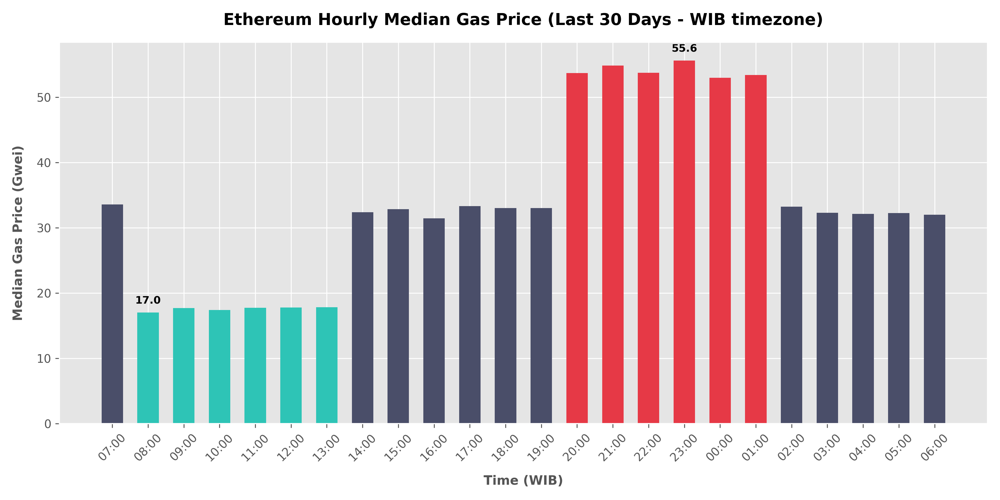
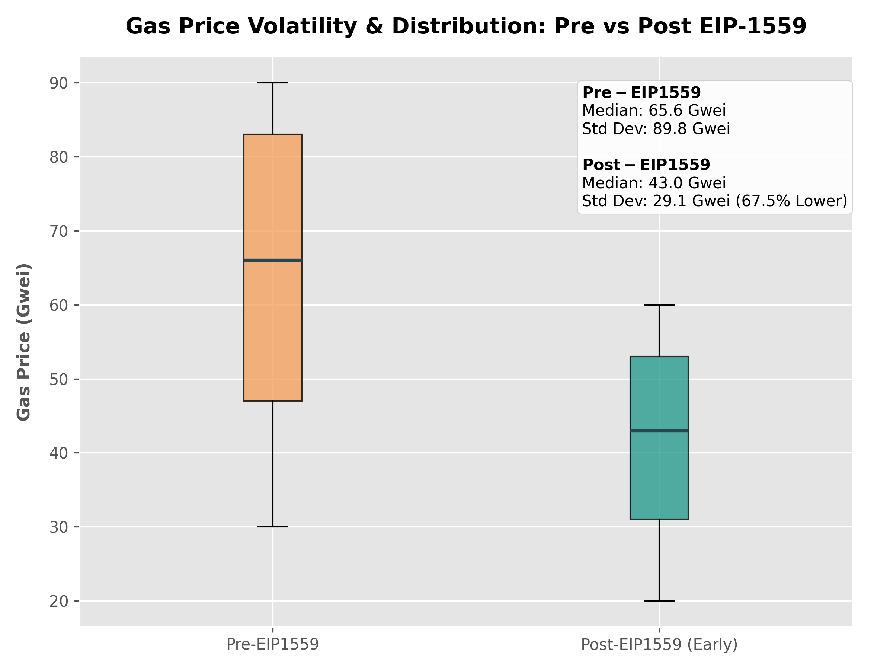

# Ethereum Gas Fee Analysis (EIP-1559) ⛽

An in-depth analysis of Ethereum gas price dynamics to identify congestion patterns and evaluate the impact of the EIP-1559 upgrade on transaction fee predictability.

---

## Research question

> What hour of the day (in UTC and WIB) offers the lowest median gas fee, and how did EIP-1559 impact fee predictability and volatility?

## Data source

- **Platform:** Google BigQuery
- **Table:** `bigquery-public-data.crypto_ethereum.transactions`
- **Time range:** Historical data surrounding EIP-1559 activation (August 2021) and the most recent 30-day transaction window.
- **Last updated:** June 27, 2026

This data is publicly queryable and verifiable via the [Google Cloud BigQuery Public Dataset Console](https://console.cloud.google.com/marketplace/product/ethereum/crypto-ethereum-blockchain).

## Methodology

1.  **Data Extraction**: Fetched transaction-level details (block number, timestamp, and gas price) from the BigQuery Ethereum transactions table.
2.  **Median vs. Mean**: Used `APPROX_QUANTILES(gas_price, 100)[OFFSET(50)]` to extract the median gas price rather than the average, **because** MEV (Maximal Extractable Value) bots frequently pay massive gas prices to frontrun trades, which heavily distorts average calculations.
3.  **Era Partitioning**: Segmented the data into `Pre-EIP1559` (blocks < 12,965,000) and `Post-EIP1559` (blocks >= 12,965,000) to evaluate the structural changes in fees.
4.  **Volatility Indexing**: Used the standard deviation (`STDDEV`) of gas prices to mathematically quantify and compare gas fee predictability across both eras.

---

## Findings

### 1. The Cheapest Hours to Transact (UTC / WIB)
*   **Finding**: The absolute cheapest time to transact is between **01:00 and 06:00 UTC** (which translates to **08:00 to 13:00 WIB** in Western Indonesian Time).
*   **Interpretation**: During these hours, the median gas fee drops to **17.0 Gwei** (which is 50% below the daily average). Conversely, the most expensive peak occurs between **13:00 and 18:00 UTC (20:00 to 01:00 WIB)**, where fees spike to **55.6 Gwei** (163% of the daily average) due to overlapping active hours in US and European financial markets.



### 2. EIP-1559 Volatility Reduction
*   **Finding**: The introduction of EIP-1559 reduced gas fee volatility (standard deviation) from **89.75 Gwei** to **29.12 Gwei** (a **67.5% reduction**), while average gas prices halved from **92.42 Gwei** to **47.76 Gwei**.
*   **Interpretation**: EIP-1559 succeeded in its core objective: making transaction fees predictable. By burning the base fee and dynamically adjusting block space, it eliminated the extreme "gas wars" and bid-pricing spikes that characterized the pre-upgrade era.



---

## So what

*   **For Users & dApps**: Automating non-time-sensitive smart contract interactions (like token vesting or liquidity harvesting) to execute between **08:00 and 13:00 WIB** can cut transaction costs in half.
*   **For Developers**: EIP-1559's predictable base fee allows protocols to implement highly accurate fee estimation algorithms, significantly reducing transaction failures due to underpriced gas.

---

## Limitations

*   **L2 Activity**: This analysis is restricted to Ethereum Layer 1 (Mainnet) and does not capture gas savings from Layer 2 scaling solutions (Optimism, Arbitrum, Base) or Blob space (EIP-4844).
*   **Historical Sample**: The Pre vs. Post comparison evaluates a sample size of 500,000 blocks surrounding the upgrade and assumes other network congestion factors remained constant.

---

## How to run

To simulate this analysis locally using the mock dataset:

```bash
# 1. Generate the local dataset
python generate_gas_data.py

# 2. Run the SQL analysis via DuckDB
python run_analysis.py
```
