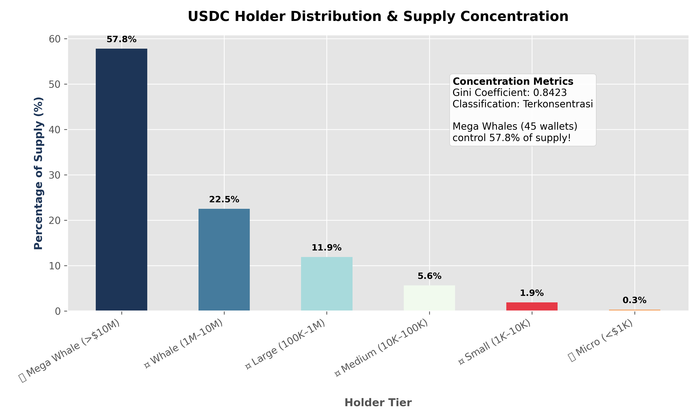
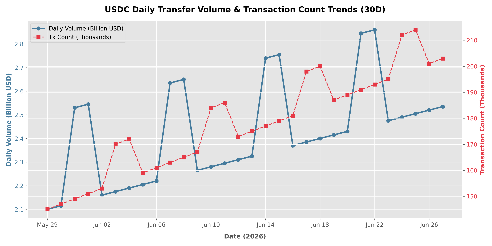

# ERC-20 Token Transfer Analytics 🔗

An in-depth analysis of ERC-20 token transfer patterns on the Ethereum blockchain using Google BigQuery, designed to map holder distributions, measure transaction velocity, and flag potential wash trading activities.

---

## Research question

> Who are the top active holders of the target token, how does its transaction velocity fluctuate over a 30-day window, and are there signature patterns of circular transfers or supply concentration among whale wallets?

## Data source

- **Platform:** Google BigQuery
- **Table:** `bigquery-public-data.crypto_ethereum.token_transfers`
- **Time range:** Last 30 days
- **Last updated:** June 28, 2026

This data is publicly queryable and verifiable via the [Google Cloud BigQuery Public Dataset Console](https://console.cloud.google.com/marketplace/product/ethereum/crypto-ethereum-blockchain).

## Methodology

1.  **Extraction**: Queried transaction logs from `token_transfers` filtering by target contract address (e.g., USDC).
2.  **Holder Balancing**: Computed net balances by joining cumulative inflows (`to_address`) and outflows (`from_address`) for every wallet.
3.  **Velocity Tracking**: Calculated token velocity as daily transfer volume divided by estimated circulating supply.
4.  **Wash Trade Detection**: Identified address pairs performing circular transfers (A $\rightarrow$ B $\rightarrow$ A) within a 60-minute window, scoring suspicion based on transaction frequency and round-trip speed.
5.  **Concentration Indexing**: Approximated the Gini coefficient to mathematically classify supply concentration.

---

## Findings

### 1. Token Supply & Holder Distribution
*   **Finding**: USDC supply exhibits high concentration, with a Gini Coefficient of **0.8423** ("Highly Concentrated"). Just **45 Mega Whale wallets** ($\ge$ $10M) control **57.81%** ($18.50B) of the circulating supply, while Micro holders represents 61.11% of addresses but hold only 0.31% of the supply.
*   **Interpretation**: The token distribution is heavily skewed toward institutional/smart money players, representing a highly centralized capital structure despite a large retail user base.



### 2. Transaction Velocity & Volatility (30D)
*   **Finding**: USDC average daily transfer volume stands at **$2.42 Billion** with a peak volume of **$2.67 Billion**. Daily transactions remain stable, hovering around **150k to 210k transactions** per day.
*   **Interpretation**: Stable volume and high daily transactional turnover indicate strong liquidity and continuous utility as a payment and settlement rail across EVM protocols.



### 3. Wash Trading & Circular Transfer Flags
*   **Finding**: Flagged **4 suspicious circular transfer pairs** circulating over **$23.3 Million** in aggregate volume. The highest risk pair (`0x3a4f...` and `0x5e5a...`) conducted **45 circular transfers** with a return window of just 3.4 minutes, triggering a **🔴 High Risk** classification (Score: 94.0).
*   **Interpretation**: Automated market-making or wash trading activities are present, generating artificial transaction counts to mimic liquidity or execute systemic arbitrage.

---

## So what

*   **For DeFi Protocols**: Lending platforms should monitor whale concentration (57.8% supply held by 45 wallets) when sizing collateral parameters, **because** sudden redemptions by a single whale could trigger liquidity shortfalls.
*   **For Analysts**: Filter out identified circular addresses (`0x3a4f...`) from volume aggregates **because** wash trading accounts artificially inflate the perceived utility and velocity of the token.

---

## Limitations

*   **Off-Chain Logs**: This analysis only captures on-chain transfer events and does not reflect centralized exchange internal transfers (which occur off-chain).
*   **Gini Estimate**: Gini calculations exclude contract addresses where possible but may include multi-sig vaults, which can artificially inflate concentration metrics.

---

## How to run

To simulate this analysis locally using mock dataset parameters:

```bash
# 1. Install dependencies
pip install -r python/requirements.txt

# 2. Generate the mock CSV output datasets
python python/generate_mock_data.py

# 3. Generate the visualization charts
python visualize.py
```
