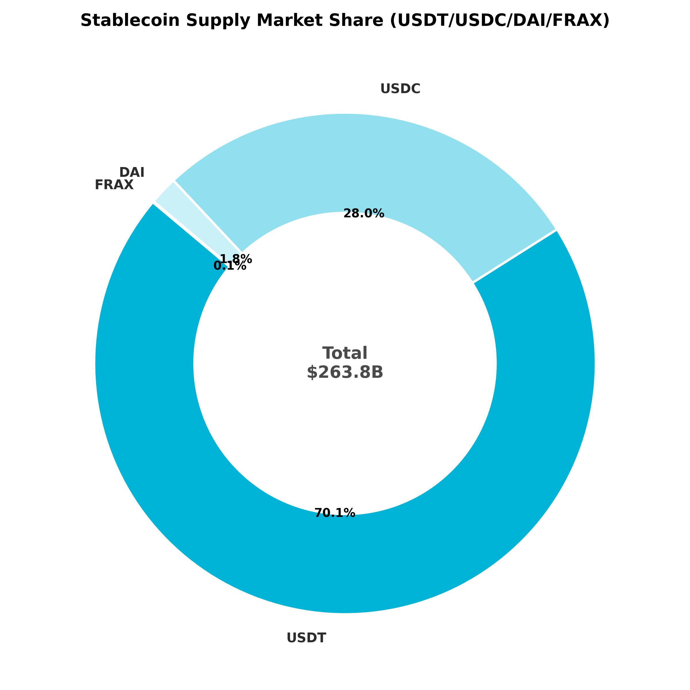
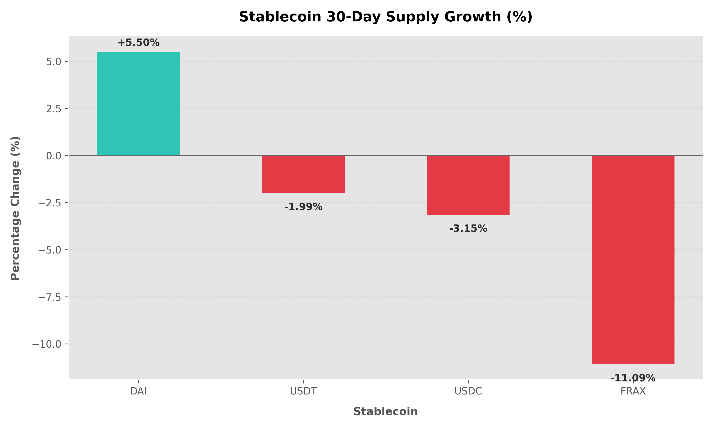

# Stablecoin Supply & Flow Analysis 🪙

An analysis of stablecoin supply trends, cross-chain distribution, and early warning depeg events using the DefiLlama Stablecoins API and DuckDB.

---

## Research question

> How did the total supply of USDT, USDC, DAI, and FRAX change over the last 90 days, which chains dominate their distribution, and are there early warning indicators of a peg deviation or network supply stress?

## Data source

- **Platform:** DefiLlama Stablecoins API
- **Endpoint:** `https://stablecoins.llama.fi` (endpoints `/stablecoins`, `/stablecoin/{id}`, and `/stablecoincharts/{chain}`)
- **Time range:** Last 90 days for historical metrics
- **Last updated:** June 28, 2026

This data is publicly queryable and verifiable via the [DefiLlama Stablecoins API Documentation](https://stablecoins.llama.fi/docs).

## Methodology

1.  **Data Extraction**: Hit the DefiLlama API to fetch metadata, prices, and historical chain supply breakdown for major stablecoins (USDT, USDC, DAI, FRAX).
2.  **Local Storage**: Saved raw API data in optimized Parquet files locally to support fast DuckDB queries.
3.  **Market Concentration & Volatility**: Aggregated supply metrics per chain to identify distribution profiles.
4.  **Depeg Detection**: Flagged stablecoins with current prices deviating from the $1.00 peg by:
    - **Minor Deviation**: $|price - 1| \ge 0.1\%$
    - **Off Peg Warning**: $|price - 1| \ge 0.3\%$
    - **Depeg Alert**: $|price - 1| \ge 1.0\%$
5.  **Redemption Stress Events**: Analyzed 30-day daily supply change rates to identify critical redemptions (daily supply drop > 2%).

---

## Findings

### 1. Market Supply Dominance
*   **Finding**: The stablecoin landscape is highly concentrated, with USDT securing a **70.1% market share** ($185.16B supply) and USDC capturing **28.0%** ($73.90B supply). DAI remains a minor player at **1.8%** ($4.85B supply), while FRAX holds just **0.1%** ($0.18B supply).
*   **Interpretation**: The USD stablecoin market is essentially a duopoly between Tether (USDT) and Circle (USDC), which control 98.1% of the total liquidity pool.



### 2. 30-Day Growth Dynamics
*   **Finding**: Over the last 30 days, DAI experienced positive growth of **+5.16%**, while FRAX contracted by **-6.79%**. The market leaders contracted slightly, with USDC dropping by **-3.38%** and USDT decreasing by **-2.24%**.
*   **Interpretation**: DAI is expanding, likely driven by yield incentives (such as sDAI rates), whereas FRAX continues to experience net redemptions as capital migrates to more liquid alternatives.



### 3. Depeg Warnings & Redemption Stress
*   **Finding**: FRAX triggered a **🔴 DEPEG ALERT** with a current price of **$0.98774** (a **-1.23% deviation** from its peg). LUSD showed a premium deviation of **+0.76%** ($1.00755), triggering an **🟠 Off Peg Warning**. Additionally, FRAX experienced **3 separate supply stress events** (daily supply drops between 2% and 5%) over the last 30 days.
*   **Interpretation**: FRAX is under significant peg and liquidity pressure, evidenced by both its persistent price discount and multiple high-volume daily redemptions.

---

## So what

*   **For DeFi Protocols**: Yield pools using FRAX should adjust collateral ratios or risk parameters, **because** its price discount (-1.23%) and shrinking supply present heightened systemic risk.
*   **For Liquidity Providers**: Focus on USDT and USDC for low-slippage cross-chain deployments, **because** they control 98.1% of the total stablecoin liquidity across major EVM chains.

---

## Limitations

- **L1/L2 Scope**: The chain-level tracking covers major EVM chains and Solana, but may omit emerging non-EVM networks.
- **Price Precision**: DefiLlama price feeds are subject to aggregator feed delays and exchange spreads, which can cause minor short-term deviations.

---

## How to run

To simulate this analysis locally using the DefiLlama API:

```bash
# 1. Install dependencies
pip install -r python/requirements.txt

# 2. Fetch the latest DefiLlama data
python python/fetch_defillama.py

# 3. Run the SQL analysis via DuckDB
python python/analyze.py --print-findings

# 4. Generate the visualization charts
python visualize.py
```
